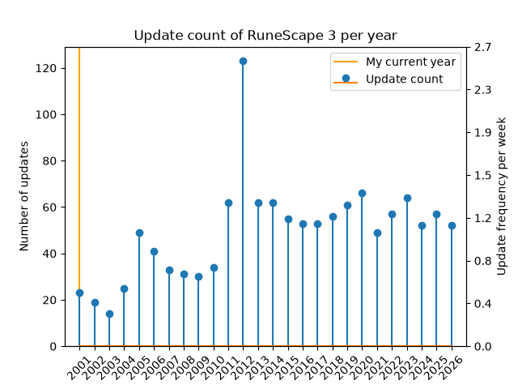
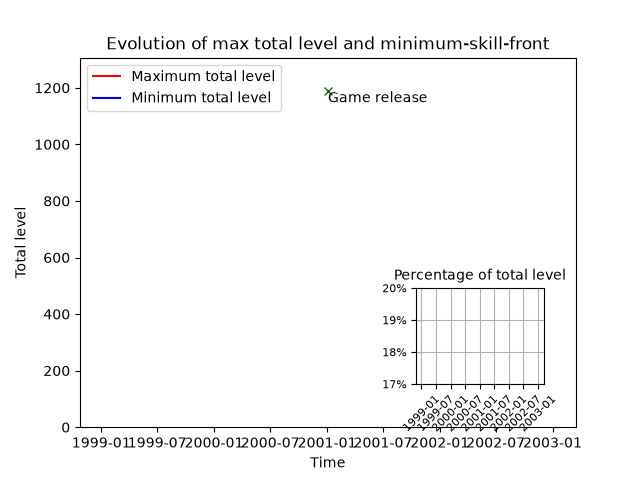
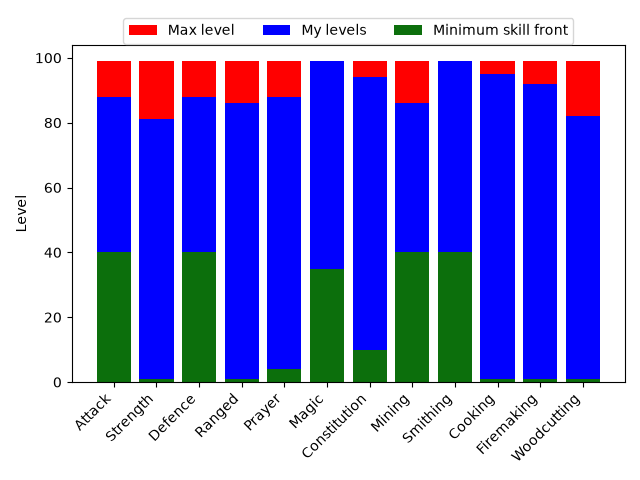

# My RuneScape journey through time

**Imagine turning time back to the 4th of January 2001 and playing though RuneScape from the launch to today. Using this reposity, you yourself can experince it.**

## What is it?

This repository documents the journey of my RuneScape 3 account throughout the ages of RuneScape. Starting from 4 January 2001, I play through every update and complete a set of goals that I have set myself. In this way, I experience every facet of the game as they were released.

To aid me in this, I have developed a set of Python tools, that scraps the [RuneScape wiki](https://runescape.wiki/w/Game_updates) for game updates. For each update, a corresponding update file is generated an put in to the [future goals](./future%20goals/) folder. When an update is completed, it will be moved in to the [completed goals](./completed%20goals/) folder.

## 🛠️ Technology stack

- Python 3
- `requests` for HTTP interaction
- `BeautifulSoup` for HTML parsing
- `click` for CLI command handling
- `re`, `pathlib`, `json` for parsing and file management

## 📁 Project layout

- [src/rshisttools/](./src/rshisttools/) – Source code of the project.
- [completed goals/](./completed%20goals/) – All completed update files. 
- [partially completed goals/](./partially%20completed/) – All partially completed update files.
- [future goals/](./future%20goals/) – All future update files organized by year.

## 📚 Data source

- This project is driven by the RuneScape Wiki list of [Game Updates](https://runescape.wiki/w/Game_updates).
- I use the [Runemetrics API](https://runescape.wiki/w/Application_programming_interface#Runemetrics) to get my account's current state.

## My account's state

- [Current date](./completed%20goals/RuneScape%20Classic/2001/2001.01.04%20-%20Day%20of%20release.md): (04 January 2001, 02 September 2008).
- [Current version](#versions): RuneScape 2
- [Current age](#age): Fifth age
- [Era](#eras): Post-split
- [My rules](./rules.md)
- [Backlog](./backlog.md) - This is the backlog. Here you can see which goals I have skipped for different reasons.
- [Minimum skill front](./minimum-skill-front.md) - This lists the minimum stat requirements at the current point in time.
- Combat level: 120.
- Total level: 1078 / 1188.

<!-- Current skills start -->
|     |     |     |
| --- | --- | --- |
|  88 |  94 |  86 |
|  81 |  |  99 |
|  88 |  |  |
|  86 |  |  95 |
|  88 |  |  92 |
|  99 |  |  82 |
<!-- Current skills end -->

*Current levels normalized to the current in-game date.*

## Cool graphs

|    |    |
|---------------------------|---------------------------|
|  |  |
| Frequency of updates per. year | Evolution of maximum total level and total level of minimum-skill-front | 
|  | ... |
| Distribution of my levels, the current minimum requirement and the maximum levels. | ... |

## Date information

### Versions

| Version | Released | Ended |
| ------- | -------- | ----- |
| RuneScape Classic | 4 January 2001 | 29 March 2004 |
| RuneScape 2 | 29 March 2004 | Present |
<!-- 
Move this up, when RuneScape 3 is launched
------------------------------------------
| RuneScape 2 | 29 March 2004 | 22 July 2013 |
| RuneScape 3 | 22 July 2013 | Present | 
-->

### Age

RuneScape is divided into different historical ages.

| Age | Name | Duration | Dates | Ended due to |
| --- | ---- | -------- | ----- | ---------------- |
| Pre-first-age |  | > 48,000 years | Pre-game | Guthix discovers Gielinor |
| First-age | Mythic period | 3,427 years | Pre-game | Arrival of gods |
| Second-age | Ancient period | 1,780 years | Pre-game | God wars begins |
| Third-age | Wartime period | 4508 years | Pre-game | Guthix banishes the god from Gielinor |
| Fourth-age | Age of Mortals | 1,952 years | Pre-game | Human discovers the Rune Essences mines which leads to human dominating Gielinor. |
| Fifth-age | Age of Man | *Still running given the current date* | In-game | *Still running given the current date* |
<!--
Move this up, when I have completed the World Wakes
---------------------------------------------------
| Fifth-age | Age of Man | 182 years | In-game and pre World Wakes quest | Sliske kills Guthix and the gods returns to Gielinor
| Sixth-age | Divine Age | *Still counting* | Post World Wakes quest | *Still doing on* |
 -->

### Eras

I have split the game into different eras that define it. *This list is not completed yet.*

#### Day of release: 4 January 2001

The first day of the game. Not much content was available yet, but still many goals remained to be completed. Since I started on a new account, all my skills were minimal. I therefore had to raise many skills before I could continue, and I treat this single day as its own era because I spent a lot of time there.

#### Free-to-play: 4 January 2001 - 27 February 2002

The free-to-play era of RuneScape. It was still a small game but with a lot of content. A lot of quests were released here together with many skill-related updates. Since my skills started low, many skill updates took a long time because I had to raise my skills to complete the tasks.

#### Member: 27 February 2002 - 29 March 2004

Membership was released together with fishing. Many new quests, skills, and other content were added.

#### Pre-split: 29 March 2004 - 10 August 2007

RuneScape 2 was released with a lot of new content. The pre-split label refers to the split between the modern version of RuneScape and Old School RuneScape. The two games diverged on 10 August 2007. For more information see the [RuneScape Wiki](https://runescape.wiki/w/Old_School_RuneScape)

#### Post-split: 10 August 2007 - 20 November 2012

Still RuneScape 2, but after the Old School/Modern split. Iconic bosses and quests were released here, including the God Wars Dungeon, Corporeal Beast, Ritual of the Mahjarrat, etc. On 20 November 2012, the [Evolution of Combat](https://runescape.wiki/w/Evolution_of_Combat) was released, which changed the combat system completely. The start of this new era did not go well, as many players disliked the update and quit the game. This drove the community to private servers, which eventually led Jagex to poll the release of Old School RuneScape based on an old 10 August 2007 backup. This kickstarted OSRS, which became the more popular game of the two. [RuneScape Wiki](https://runescape.wiki/w/Old_School_RuneScape).

*Last updated: 06 October 2026*
