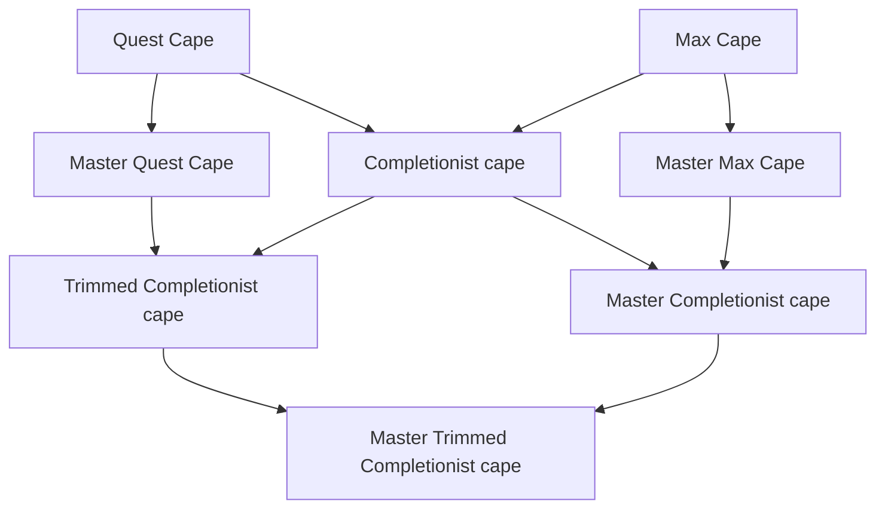

# IDEA: Tags on achievments

Wouldn't it be nice if you should sort the tasks into categories like; f2p/p2p, drop, skill, boss, treasure-trails, etc.

| Tag   | Explaination |
| ---   | ------------ |
| F2P   | If the goal can be completed by free-to-play players. |
| P2P   | If the goal can only be completed by members. |
| Clue  | A drop related to Treasure Trails. |
| Drop  | A drop which does not belong to the Treasure Trails table. |
| Skill | A skill based goal. Not only levels, but also "make a rune platebody" kind of goals. |
| Monster | Task related to monsters/bosses. |
| Quest | Quest related. |
| Minigame | Minigame related. |
| Pet | Related to pet drops. |
| Title | Title based goals. |

## Pros and Cons

### Pros

- I can sort goals more easily
- Baglog is easier to sync.
- I can make nice graphs showning my progress on different levels

### Cons

- I need to go through all already completed goals
- New goals requires more work
- Hard maintenace - I need to go through all goals if a new tag is added.

## Goals that I want to track

- Minigame goals

- Completionist goals
  - Max cape
  - Quest cape
  - Master Max cape
  - Master Quest cape
  - Completionist cape
  - Trimmed Completionist cape
  - Master Completionist cape
  - Trimmed Master Completionist cape

- Skilling
  - Level goals - *Does not require a tag*
  - Skilling tasks

- Collections
  - Pets
  - Equipment
  - Boss drop goals
  - Treasure trail goals
  - Generel collection log goals
  - Other rare items - *Those that are not related to boss drops like the Pirat's hook.*

## Formatting of goals

\- [x] \<*goals*\> - \<*description*\> - (\<*tag1*\>, \<*tag2*\>, ...)

## Graph over Completionist achievments 

